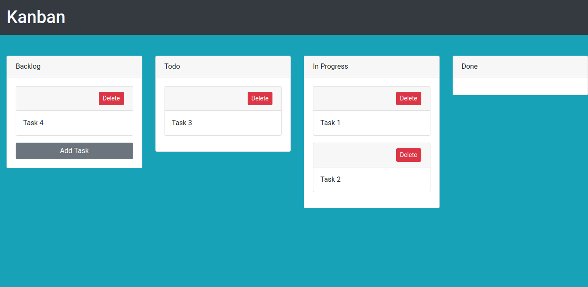

# Demo
https://kkpnnkkzov.codesandbox.io

# How to run the app
1. run `yarn install`
2. run `yarn start`
3. open web browser http://localhost:3000

# How to use the app
- To Add Task: Click `Add Task` to adding task to Backlog list.
- To Edit Task: Click on Task body. And just click another area to automatically save.
- To Move Task: Drag and drop Task to another List (Backlog, Todo, In Progress and Done).
- To Delete Task: Click on `Delete` button on each Task header.

# Screenshot

